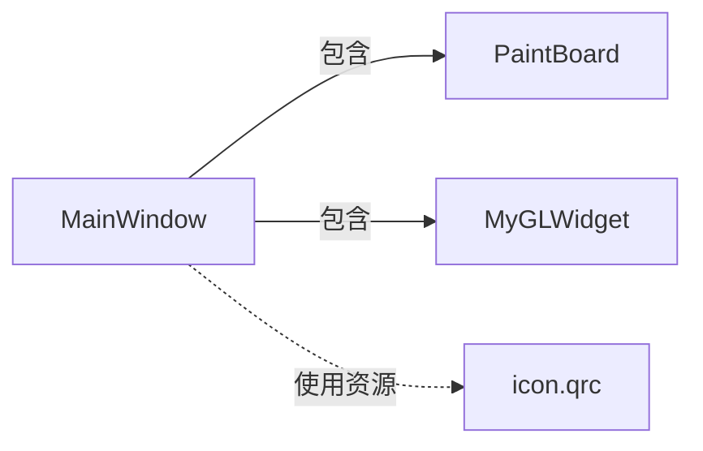

# 功能展示和实现原理介绍

[TOC]

## 1. 整体结构

系统的整体结构如下图所示：

其中MainWindow为主窗口，实现主界面并提供主界面到各种功能之间的连接。

PaintBoard为画板类，实现所有与二维图形有关的功能，包括输入、填充、变换、裁剪等。

MyGLWidget为三维窗体类，实现与三维模型有关的功能，基本功能包括三维模型显示，还拓展了三维模型的旋转（随鼠标运动）和三维模型的缩放（鼠标滚轮控制）。

icon.qrc用于管理与系统有关的所有资源文件，主要包括各种图标。

**代码量统计：**

| 文件名         | 代码行数（单位：行） |
| -------------- | -------------------- |
| main.cpp       | 10                   |
| mainwindow.h   | 90                   |
| mainwindow.cpp | 350                  |
| paintboard.h   | 200                  |
| paintboard.cpp | 1600                 |
| myglwidget.h   | 60                   |
| myglwidget.cpp | 200                  |
| **共计：**     | **约2500**           |

## 2.功能介绍

### 运行环境

Windows10 + Qt5.x + OpenGL2.x 

### 功能展示

##### 主界面

##### 二维图形输入

##### 改变画笔颜色

##### 区域填充

##### 将绘制的图形保存为图像

##### 打开图片

##### 图形平移

##### 图形旋转

##### 图形放缩

##### 图形裁剪

###### 线段裁剪

###### 多边形裁剪

###### 裁剪窗口可编辑

**如图所示，虚线框为裁剪窗口，可由用户自定义。本系统中旋转窗口、放缩窗口也是可编辑的**

##### 三维模型显示

### 动态展示

点击[这里](https://github.com/KSDeng/pictures/blob/master/pictures/%E5%9B%BE%E5%BD%A2%E5%AD%A612%E6%9C%88/%E5%9B%BE%E5%BD%A2%E5%AD%A6%E5%A4%A7%E4%BD%9C%E4%B8%9A%20%E5%8A%A8%E6%80%81%E6%95%88%E6%9E%9C%E5%B1%95%E7%A4%BA.md)

备用链接：

https://github.com/KSDeng/pictures/blob/master/pictures/%E5%9B%BE%E5%BD%A2%E5%AD%A612%E6%9C%88/%E5%9B%BE%E5%BD%A2%E5%AD%A6%E5%A4%A7%E4%BD%9C%E4%B8%9A%20%E5%8A%A8%E6%80%81%E6%95%88%E6%9E%9C%E5%B1%95%E7%A4%BA.md

## 3.算法介绍

### 算法综述

本系统自行实现的算法主要包括：**DDA画线算法、中点画线算法、中点椭圆生成算法、注入填充算法、扫描线填充算法、平移坐标变换、旋转坐标变换、双线性插值算法（用于放缩）、Cohen-Sutherland算法（用于线段裁剪）、Sutherland-Hodgman算法（用于多边形裁剪）以及基于OpenGL的三维模型显示**

### 具体实现

#### DDA画线算法

​	利用光栅特性(屏幕单位网格表示像素列阵)，使用x或y方向单位增量(△x或△y=±1)来离散取样，并逐步计算沿线路径各像素位置。在一个坐标轴上以单位间隔对线段离散取样，确定另一个坐标轴上最靠近线段路径的对应整数值。

​	**实现过程中的一个难点在于对各种情况的分类讨论。**

#### 中点画线算法

​	原理：设线段的起点和终点分别为 ： ( x0 , y0 ) 和( x1 , y1 )，直线方程为：F(x , y) = ax + by + c，其中，a=y0－y1，b=x1－x0， c=x0y1－x1y0 。则有：

​	**直线上的点，F (x，y) = 0 ；直线上方的点，F(x，y)>0 ；直线下方的点，F(x，y)<0** 

​	将M代入F(x，y) ，

​	 d = F(M) = F( xi+1，yi+0.5 ) = a ( xi+1 ) + b ( yi+0.5 ) + c

​	当 d < 0 时，M在直线下方(即在Q的下方) ，应取右上方的P2 。

​	而当d > 0，则取正右方的P1。

​	当d=0时，二者一样合适，取P1。

​	**实现过程中一个易错点：纸上作图时习惯将y轴正方向朝上,但屏幕上的y轴正方向是朝下的。虽然是非常简单的一点，但实际操作过程中由于习惯原因容易忘记，导致代码出现隐含的错误。**

#### 中点椭圆生成算法

​	原理：给定长短轴参数rx、ry(假设ry≤rx)和椭圆中心位置(xc,yc)，

​	利用平移：先确定中心在原点的标准位置的椭圆点(x,y)；然后将点变换为圆心在(xc,yc)的点。

​	对称性：生成第一象限内的椭圆弧，再利用对称性求出其它三个象限的对应点。

​	定义椭圆函数为：

​                 	 fellipse(x,y)=ry2x2+rx2y2-rx2ry2

​	该函数具有下列特性：

​	**fellipse(x,y)＜0，(x,y)位于椭圆边界内；fellipse(x,y)＝0，(x,y)在椭圆边界上；fellipse(x,y)＞0，(x,y)位于椭圆边界外。**

​	将椭圆函数fellipse(x,y)作为中点算法的决策参数，在每个取样位置，按照椭圆函数在沿椭圆轨迹两个候选像素间中点求值的符号选择下一个像素。

​	**该算法原理与中点画线算法大同小异，主要区别在于判别式不同，以及注意不同判别式适用的范围以及不同范围之间的边界。**

#### 注入填充算法

​	原理：从区域内的指定位置开始，通过深度优先搜索递归遍历上、下、左、右四个方向到达区域内的任意像素，并将到达的点都替换成另一种颜色，从而实现填充效果。

​	**实现该算法后发现一个问题：由于算法递归次数过多，导致栈空间不足，在需要填充的区域面积较大时，算法会导致栈溢出（stack overflow），进而导致程序崩溃。解决这一问题的办法是采用扫描线填充算法。**

#### 扫描线填充算法

​	该算法可分为以下几个步骤：

​	(1) 初始化一个空的栈用于存放种子点，将种子点(x, y)入栈；

 	(2) 判断栈是否为空，如果栈为空则结束算法，否则取出栈顶元素作为当前扫描线的种子点(x, y)，y是当前的扫描线；

 	(3) 从种子点(x, y)出发，沿当前扫描线向左、右两个方向填充，直到边界。分别标记区段的左、右端点坐标为xLeft和xRight；

 	(4) 分别检查与当前扫描线相邻的y - 1和y + 1两条扫描线在区间[xLeft, xRight]中的像素，从xLeft开始向xRight方向搜索，若存在非边界且未填充的像素点，则找出这些相邻的像素点中最右边的一个，并将其作为种子点压入栈中，然后返回第(2)步。

#### 平移坐标变换

​	在使用平移功能时先选择需要平移的区域，然后通过拖动定位到需要平移的位置。**将选中的区域的像素点坐标按平移前后的坐标差进行重新定位**。原始位置P(x,y)按平移距离tx和ty到新位置P1(x1,y1)的移动：

​	x1=x+tx, y1=y+ty

​	(tx, ty) - 平移向量/转换向量

#### 旋转坐标变换

​	采用旋转矩阵对选中区域的像素点进行坐标变换。

#### 双线性插值算法

​	**采用双线性插值算法**，先逆向计算某个点在放缩前的位置，取该位置附近4个点（当该位置的横纵坐标中存在整数时为取2个或者1个），进行双线性插值得到放缩后的该位置的RGB值。

​	原理：如图，已知Q12，Q22，Q11，Q21，用双线性插值法计算P点的值。思路是**首先在x轴方向上对R1和R2两个点进行插值，然后根据R1和R2对P点进行插值。**

首先在 x 方向进行线性插值，得到

然后在 y 方向进行线性插值，得到

联立以上两式，得到最终结果为：

#### Cohen-Sutherland算法

​	原理：先对区域进行编码，再根据编码进行点的取舍与坐标变换。**具体不再赘述，实现见paintboard.cpp**

#### Sutherland-Hodgman算法

​	原理 ：**多边形边界作为一个整体，关于裁剪窗口对每条边界进行裁剪**。裁剪过程如下

 * 对多边形顶点集初始化(顺或逆时针排序)；

 * 依次用裁剪窗口左右上下边界对多边形裁剪；

 * 每次裁剪结果依次作为下次裁剪的输入；

 * 每次裁剪结果＝新顶点序列＋原顶点序列。

   **具体原理不再赘述，实现见paintboard.cpp**

   

#### OpenGL三维模型显示

​	原理：**解析off文件中的数据，依次获取点的坐标数据和每个面的点索引数据，再利用OpenGL提供的API将面依次画出。具体实现见myglwidget.cpp**

## 4. 参考资料

* [https://www.w3cschool.cn/learnroadqt/tufx1j3q.html](https://www.w3cschool.cn/learnroadqt/tufx1j3q.html)

  Qt 学习之路W3Cschool

* [https://www.cnblogs.com/vagabond/p/4315369.html](https://www.cnblogs.com/vagabond/p/4315369.html)

  Qt 信号槽如何传递参数（或带参数的信号槽）

* [https://zhuanlan.zhihu.com/p/20213658](https://zhuanlan.zhihu.com/p/20213658)

  绘制直线的光栅化算法

* [https://blog.csdn.net/orbit/article/details/7323090](https://blog.csdn.net/orbit/article/details/7323090)

  算法系列之十二：多边形区域填充算法－－递归种子填充算法

* [https://blog.csdn.net/orbit/article/details/7496008](https://blog.csdn.net/orbit/article/details/7496008)

  算法系列之十三：椭圆的生成算法

* [https://blog.csdn.net/daichanglin/article/details/1563299](https://blog.csdn.net/daichanglin/article/details/1563299)

  RGB 常用颜色列表

* [http://lisanping.iteye.com/blog/75401](http://lisanping.iteye.com/blog/75401)

  判断点是否在矩形里面

* [https://blog.csdn.net/xiaqunfeng123/article/details/17362881](https://blog.csdn.net/xiaqunfeng123/article/details/17362881)

  图像缩放——双线性插值算法

* [https://blog.csdn.net/ljheee/article/details/73250887](https://blog.csdn.net/ljheee/article/details/73250887)

  计算机图形学----直线与多边形的裁剪

* [https://blog.csdn.net/dcrmg/article/details/52416832](https://blog.csdn.net/dcrmg/article/details/52416832)

  向量点乘（内积）和叉乘（外积、向量积）概念及几何意义解读

* [https://www.cnblogs.com/mythou/p/3327046.html](https://www.cnblogs.com/mythou/p/3327046.html)

  左手坐标系和右手坐标系

* [https://blog.csdn.net/damotiansheng/article/details/43274183](https://blog.csdn.net/damotiansheng/article/details/43274183)

  多边形裁剪一：Sutherland-Hodgman算法

* [https://blog.csdn.net/cly116/article/details/47184729](https://blog.csdn.net/cly116/article/details/47184729)

  【Qt OpenGL】Qt Creator中的3D绘图及动画教程

* [https://blog.csdn.net/learn_sunzhuli/article/details/45029081](https://blog.csdn.net/learn_sunzhuli/article/details/45029081)

  QT 鼠标和滚轮事件学习
